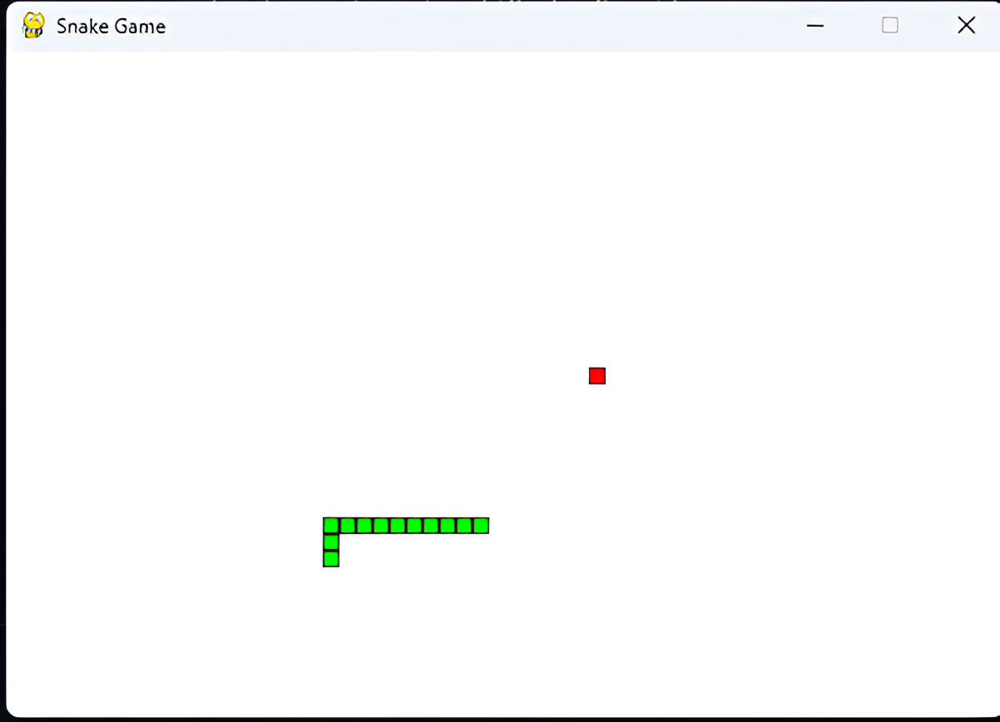

## Snake Game With PyGame

> This code is basic

## Use

# Step 1
> Download or Clone this repo and enter to files
```bash
git clone https://github.com/zzephryyk/SnakeGame && cd SnakeGame
```
# Step 2
> Install the necessary libraries with pip
```bash
pip install -r requirements.txt
```
# Step 3
```bash
python App.py
```

# Step 3
> Enjoy this shit 🗿

